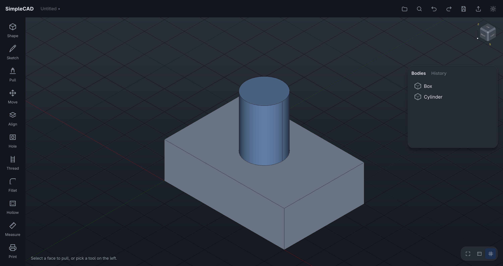

# SimpleCAD

Modern parametric CAD for Fedora, built for mechanical design and functional
3D printing.

**Easy by default. Powerful when needed.** The viewport is the application:
tools appear when they are relevant, panels float over the model rather than
boxing it in, and every dimension accepts an expression as readily as a number.



## What works today

**The full workflow runs end to end**, verified by `scripts/acceptance_ui.py`
driving the real UI:

```
Create Box → Pull Face → Create Second Part → Stack Faces →
Add Hole → Create Automatic Thread Pair → Fillet → Export
```

| Area | State |
|---|---|
| **Viewport** | OCCT rendering into Qt's framebuffer, so panels composite over the model. ViewCube, ortho & perspective, six standard views, zoom to fit & to selection, hover highlight, face/edge/vertex/body selection. A **ground grid** at 10 / 50 mm gives depth and position a reference, and every body gets its own tint so two parts are never one silhouette |
| **Camera** | **Turntable orbit around what you are looking at** — the selection, or whatever is under the cursor — so the thing you are inspecting stays put while you sweep around it. The up vector is re-derived from the view direction every frame, so roll is not merely small but exactly zero and the horizon can never end up crooked; pitch stops short of the poles, so the model never flips. Middle-drag or Alt-drag orbits, Shift pans, and the wheel zooms at the cursor with a step taken from the size of the gesture — so a **trackpad's** burst of thirty small scrolls is a smooth zoom rather than a bolt across the scene. Pinch zooms where the platform offers it. Standard views and the ViewCube **sweep** to the new orientation instead of cutting, and re-aim without also re-framing |
| **Measure** | Two ways of asking. **Entities**: length, distance, angle, area, volume, radius, diameter, centre distance and minimum distance — dispatched from the selection, so picking two holes reports the pitch without choosing a mode. **Point to point**: a circular indicator follows the cursor and **snaps** to the places that mean something — corners, edge midpoints, arc and hole centres, face centres — and, where none of those is near, to the point on the face or along the edge the cursor is actually over, so the indicator never blinks out and a click never lands on nothing. What gets picked is exactly what the indicator was drawn on. The first point is filled and the second hollow, a rubber band follows the cursor with the running length, and the reading is drawn on the model |
| **Construction geometry** | Offset plane, midplane, plane at an angle, plane through points, tangent plane, axis and point — all parametric, so they follow the geometry they came from |
| **Direct manipulation** | Select a face and **drag it** to push/pull, with a live translucent preview and the **resulting size** shown at the cursor as you go — not just how far you have moved. Pushing inward turns the body translucent so the material being removed is actually visible, and the drag snaps to 0.25 mm (Shift for free, Ctrl for 0.05 mm) so landing on a round number is the default. **Fillet and Chamfer put a handle on the edge** and you pull the corner to size: the handle stands off the edge by the radius, so where it sits *is* how big the result will be, and the preview is the genuine filleted body rather than an approximation — a radius the kernel refuses keeps the last good preview and turns the readout red instead of blanking it. A full **transform gizmo** — X/Y/Z arrows, plane handles and rotation rings — moves and turns bodies by dragging. Every operation also takes an exact number, and both routes write the same parametric feature |
| **Parametric core** | Global N-in/N-out feature graph, dependency-driven rebuild, named parameters and expressions, durable topological references, friendly errors, last-valid-model retention |
| **Primitives** | Box, Cylinder, Sphere, Cone, Torus, Tube, Wedge — created and sized without a sketch. **Triangle, Pentagon, Hexagon and Octagon** prisms as their own tiles (even-sided sized across flats, odd-sided by their corner circle), plus a Polygon prism for any other side count. **Vent**: a hex grille for a fan, as a plate of its own or cut straight through a wall you already have |
| **Modelling** | Press/Pull, Move, Rotate, Scale, Join / Cut / Intersect, Fillet, Chamfer, **Hollow** (shell to a wall thickness — pick the face to open and a box becomes a bucket), Hole (simple, counterbore, countersink, threaded) |
| **Split** | Cut a part into two independent bodies by **dragging a plane through it**. The plane carries five handles — one at its centre and one at the middle of each edge — so whichever way the model is turned there is one facing the camera, and the readout that follows it is the **resulting size of both halves**, live. X, Y, Z or the plane of a selected face; an exact position can be typed instead. What comes out is two bodies, separately selectable, movable, groupable and deletable, and deleting one leaves the other |
| **Grouping** | Multi-select and **Group**: one thing to select, move, rotate, duplicate, hide and delete, with the bodies inside kept whole and separate — organisational, never a boolean union. Groups nest, and the model tree shows membership as a tree. Clicking a member selects the group; double-clicking reaches inside for the one object. Ungroup puts everything back |
| **Advanced modelling** | Sweep along a path, Loft between profiles, Draft, Mirror, and rectangular / circular / along-path patterns — all parametric, so changing a pattern count moves every copy |
| **3D Print workspace** | Elegoo Centauri Carbon 2 profile (256³ mm). Place on plate, Center, and Orient for printing. Printability analysis — build volume, watertightness, disconnected pieces, overhangs, thin walls, tiny features — reported as warnings that never block export. Export for Printing (3MF) and open straight in a detected slicer |
| **Sketching** | **Draw with the mouse** on any base plane — line, polyline, rectangle, centre-rectangle, circle, arc, polygon, slot, point — with snapping to existing points and the grid, and Horizontal/Vertical constraints inferred as you draw. **`D → click → type → Enter`** dimensions geometry on the canvas; dimensions are clickable labels and editing one re-solves the sketch. Parametric throughout: 16 constraint types, a Levenberg–Marquardt solver, and state read from the Jacobian's rank so *Fully constrained* actually means it. Extrude and Revolve build from the result |
| **Align / Stack / Mate** | Stack, Center, Concentric, Align, with Flip and Offset — and smart suggestion from the selection |
| **Threads** | ISO Metric, UNC, UNF, BSP, NPT (89 sizes). Automatic size recommendation, modelled printable geometry, internal/external detection, **matched thread pairs across two parts** with printable clearance. **Create Matching Part** builds the bolt, nut or threaded hole that fits an existing thread — read off the feature history, so the size is never asked for twice |
| **Fit & Clearance** | Sliding / Snug / Press / Loose / Thread presets, and a **calibration model** — a pin strip and a labelled plate of holes at 0.05–0.50 mm — so the presets can be tuned to your own printer. Measured values are stored per printer and override the shipped defaults everywhere |
| **Import / Export** | Written: STEP, STL, OBJ, 3MF. **Read: STEP, IGES, B-Rep, STL, OBJ, 3MF and glTF**, from the toolbar, `Ctrl+I` or search. Dimensions and units are preserved (a STEP file in inches arrives in millimetres, not scaled by 25.4), separate bodies stay separate where the format describes them, and STEP part names come through. A mesh is sewn back into a **solid** so an imported STL can be split, cut and shelled like anything else — and where it is too large or does not close, the body still imports and says so rather than failing quietly. An unreadable file gets a message, not silence |
| **Project file** | Native `.scad3`: save and reopen a model that is still fully parametric, with a geometry cache so opening is instant |
| **Contextual toolbar** | The bar over the viewport offers **everything** that applies to what is selected, and refreshes the instant the selection changes. A face exposes Pull, Hole, Sketch and Hollow; an edge or a corner exposes Fillet and Chamfer; a body exposes Move, Rotate, Scale, Split, Duplicate, Measure, Hide and Delete; two bodies lead with Group; a group leads with Ungroup. What does not fit goes behind a visible `⋯` rather than being silently dropped |
| **Quality of life** | Undo / redo with named actions, autosave and crash recovery, command search (`S`), light / dark / system themes |
| **Responsiveness** | Geometry runs in a separate process, so the window never freezes while the kernel works. Falls back to in-process if it cannot start |

Everything in the specification is implemented. What is left is depth: there is
no settings window for rebinding shortcuts (they are stored and read, just not
editable in the UI), on-canvas dimensioning covers distance and diameter but not
angle, sketch geometry is edited by dimensioning rather than by dragging, and
patterns copy whole bodies rather than individual features. See
[docs/roadmap.md](docs/roadmap.md). Threading and aligning are offered
as separate contextual actions rather than the spec's combined "Align & Stack" /
"Preview Assembled" commands. See [docs/roadmap.md](docs/roadmap.md) for the
full list.

**Responsiveness.** Rebuilds run in a separate geometry process, so the window
stays live while OCCT works — measured at a 77 ms worst stall across a 3.3 s
threaded hole, where doing the same work on the UI thread freezes it for the
whole 3.1 s. A worker *thread* cannot achieve this: the OCP bindings hold the GIL
for the whole of every kernel call, so a threaded version measured ten times
slower and was reverted. See [docs/architecture.md](docs/architecture.md) for the
measurements.

## Requirements

Fedora 41+ with Python 3.12–3.14 and an OpenGL 3.3 driver. Everything else is
installed into a project-local virtual environment.

## Install and run

```bash
./scripts/setup.sh     # creates .venv and installs the kernel + Qt bindings
./bin/simplecad        # launch
```

The launcher pins `QT_QPA_PLATFORM=xcb`. The OCCT build SimpleCAD uses speaks
GLX rather than EGL, so on Wayland it runs through XWayland — the same thing
FreeCAD does, and not something you will notice.

## Interaction

| | |
|---|---|
| Orbit | Middle-drag, or Alt + left-drag |
| Pan | Shift + middle-drag |
| Zoom | Wheel |
| Select | Left-click. Shift or Ctrl to add |
| Push / pull a face | Select it, then drag it |
| Draw a sketch | Sketch → pick a plane → Draw it instead |
| Dimension | `D`, then click geometry, type, Enter |
| Measure | Select geometry, then Measure |
| Measure point to point | Measure → Point to point, then click two places |
| Hollow a body | Select the face to open, then Hollow |
| Vent a wall | Select a flat face, then Vent |
| Ground grid | The grid button, bottom right |
| Sketch on a face | Select a flat face, then Sketch |
| Move / rotate a body | Move, then drag the gizmo handles |
| Command search | `S` |
| Undo / redo | `Ctrl+Z` / `Ctrl+Shift+Z` |
| Standard views | `1`–`7` (front, back, left, right, top, bottom, iso) |
| Zoom to fit | `F` |
| Zoom to selection | `Ctrl+Shift+F` |
| Cancel / confirm | `Esc` / `Enter` |
| Save / Save As / Open | `Ctrl+S` / `Ctrl+Shift+S` / `Ctrl+O` |
| Export | `Ctrl+E` |
| Delete | `Delete` |

Dimension fields take expressions: `12`, `12mm`, `0.5in`, `wall`, `width / 2`,
`hole + 0.4mm`.

## Development

```bash
.venv/bin/python -m pytest -m "not slow"   # ~20 s
.venv/bin/python -m pytest                 # includes modelled-thread tests, ~5 min

.venv/bin/python scripts/acceptance_ui.py    # the workflow above, through the UI
.venv/bin/python scripts/spike_viewport.py   # viewport regression check
.venv/bin/python scripts/check_picking.py    # face / edge / vertex pick priority
.venv/bin/python scripts/check_drag.py       # drag a face, check it moved
.venv/bin/python scripts/check_undo.py       # undo / redo through the window
.venv/bin/python scripts/check_sketch.py     # sketch every profile and extrude it
.venv/bin/python scripts/check_typing.py     # typing must not fire shortcuts
.venv/bin/python scripts/check_responsive.py # UI stays live during a slow rebuild
.venv/bin/python scripts/check_print.py      # place, orient, analyse, export
.venv/bin/python scripts/check_draw.py       # draw a sketch with the mouse
.venv/bin/python scripts/check_dimension.py  # D, click, type, Enter
.venv/bin/python scripts/check_gizmo.py      # drag the transform gizmo
.venv/bin/python scripts/check_complete.py   # measure, face sketching, browser
.venv/bin/python scripts/check_hollow.py     # box -> open face -> bucket
.venv/bin/python scripts/check_vent.py       # hex grille, as a plate and as a cut
.venv/bin/python scripts/check_shapes.py     # every shape tile builds what it says
.venv/bin/python scripts/check_measure_points.py  # snap to a corner, measure to another
.venv/bin/python scripts/check_measure_snap.py    # the indicator follows, and tells the truth
.venv/bin/python scripts/check_push.py       # push a face in: preview, readout, guard
.venv/bin/python scripts/check_camera.py     # orbit the selection, never roll, never flip
.venv/bin/python scripts/check_fillet_drag.py    # pull a fillet out with the mouse
.venv/bin/python scripts/check_split.py      # drag a plane through a part, get two
.venv/bin/python scripts/check_context_bar.py    # the bar loads completely, every time
.venv/bin/python scripts/check_import.py     # STEP and STL in, selectable and editable
.venv/bin/python scripts/check_group.py      # group, move together, reach inside, ungroup
.venv/bin/python scripts/shot_theme.py       # theme switch with panels open
.venv/bin/python scripts/shot_app.py out.png # screenshot the app
```

Layout, and the reasoning behind the awkward parts, is in
[docs/architecture.md](docs/architecture.md) — in particular how OCCT is made to
render into a `QOpenGLWidget` and why the feature graph is not a per-body
history.
